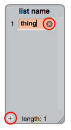

## Maak 'n lys

+ Klik op **Data** in die Scripts-oortjie, en klik dan op **Maak 'n lys**.

+ Tik die naam van jou lys in. U kan kies of u wil hê dat u lys beskikbaar is vir alle sprites of slegs op 'n spesifieke sprite. Druk **OK**.

+ Sodra jy die lys geskep het, sal dit op die verhoog vertoon word, of jy kan die lys onttrek in die Scripts-oortjie om dit weg te steek.

+ Klik die `+` onderaan die lys om items by te voeg en klik die kruisie langs 'n item om dit uit te vee.

+ Nuwe blokke verskyn en laat jou toe om jou nuwe lys in jou projek te gebruik.

