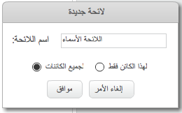

## إنشاء قائمة

+ انقر فوق **البيانات** في علامة التبويب نصوص برمجية، ثم انقر فوق **إنشاء قائمة**.

+ اكتب اسم القائمة. يمكنك أن تختار أن تكون القائمة متاحة لكل الكائنات، أو لكائن محدد فقط. اضغط على **موافق**.

+ بمجرد إنشاء القائمة، ستظهر على المنصة، أو يمكنك إلغاء تحديد القائمة من علامة التبويب نصوص برمجية لإخفائها.

+ انقر فوق الرمز `+` الموجود أسفل القائمة لإضافة العناصر، وانقر فوق الرمز (×) الموجود بجوار العنصر للحذف.

+ ستظهر قوالب جديدة تسمح لك باستخدام قائمتك الجديدة في مشروعك.

