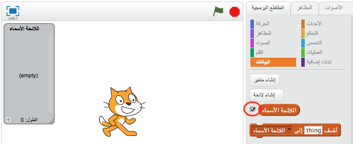
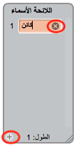
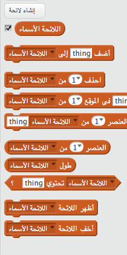

## إنشاء لائحة

+ انقر فوق **البيانات** في علامة تبويب المقاطع البرمجية، ثم انقر فوق **إنشاء لائحة**.

+ اكتب اسم اللائحة الخاص بك. يمكنك إختيار ما إذا كنت تريد أن تكون اللائحة الخاص بك متاحه لجميع الكائنات، أو لكائن واحد فقط. اضغط على **موافق**.

+ بمجرد إنشاء اللائحة، ستظهر على المنصة، أو يمكنك إلغاء تحديد اللائحة من علامة تبويب المقاطع البرمجية لإخفائه.

+ اضغط على `+` في أسفل اللائحة لإضافة عناصر أو كائنات، و اضغط على الإكس بجانب المتغير لحذفة.

+ تعليمات برمجية جديدة ستظهر لك وستمكنك من إستخدام اللائحة في مشروعك.

