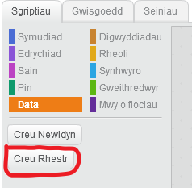
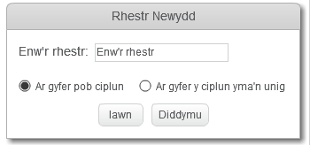
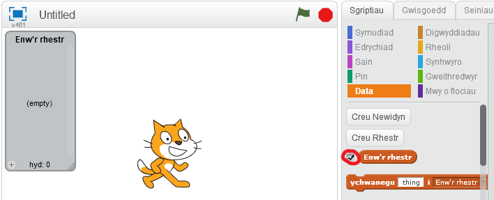
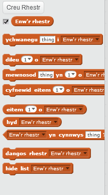

## Gwneud rhestr

+ Clicia ar **Data** yn y tab Sgriptiau, yna clicia ar **Creu Rhestr**.

+ Teipia enw dy restr i mewn. Gelli di ddewis a fydd y rhestr ar gael i bob ciplun, neu i giplun penodol yn unig. Clicia **Iawn**.

+ Ar ôl i ti greu'r rhestr, bydd yn cael ei harddangos ar y llwyfan, neu gelli di ddileu tic y rhestr yn y tab Sgriptiau i'w chuddio.

+ Clicia ar y `+` ar waelod y rhestr i ychwanegu eitemau, a chlicia ar y groes ar ymyl eitem i'w dileu.

+ Bydd blociau newydd yn ymddangos ac yn dy alluogi i ddefnyddio dy restr newydd yn dy brosiect.

