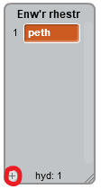

## Gwnewch restr

+ Cliciwch ar **Data** yn y tab Sgriptiau, yna cliciwch ar **Gwnewch Restr**.

+ Teipiwch enw'ch rhestr. Gallwch ddewis a hoffech i'ch rhestr fod ar gael i bob sprites, neu i sprite penodol yn unig. Gwasgwch **OK**.

+ Unwaith y byddwch wedi creu'r rhestr, bydd yn cael ei arddangos ar y llwyfan, neu gallwch ddatgymalu'r rhestr yn y tab Sgriptiau i'w guddio.

+ Cliciwch y `+` ar waelod y rhestr i ychwanegu eitemau, a chliciwch y groes nesaf at eitem i'w ddileu.

+ Bydd blociau newydd yn ymddangos ac yn caniatáu i chi ddefnyddio'ch rhestr newydd yn eich prosiect.

