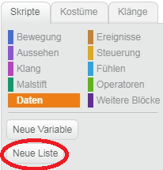
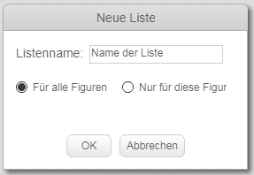
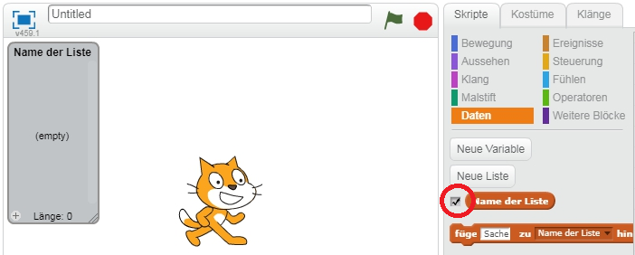
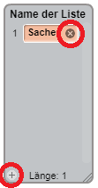
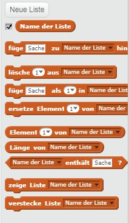

## Mache eine Liste

+ Klicken Sie auf | 123_8_0_321 | Daten | 123_9_1_321 | Klicken Sie auf der Registerkarte Skripts auf | 123_8_2_321 | Eine Liste erstellen | 123_9_3_321 |.

+ Geben Sie den Namen Ihrer Liste ein. Sie können auswählen, ob Ihre Liste für alle Sprites oder nur für ein bestimmtes Sprite verfügbar sein soll. Drücken Sie | 123_8_0_321 | OK | 123_9_1_321 |.

+ Sobald Sie die Liste erstellt haben, wird sie auf der Bühne angezeigt, oder Sie können die Liste auf der Registerkarte Skripte deaktivieren, um sie auszublenden.

+ Klicken Sie auf | 123_6_0_321 | + | 123_7_1_321 | Klicken Sie unten in der Liste auf Elemente, und klicken Sie auf das Kreuz neben einem Element, um es zu löschen.

+ Neue Blöcke werden angezeigt und Sie können Ihre neue Liste in Ihrem Projekt verwenden.

