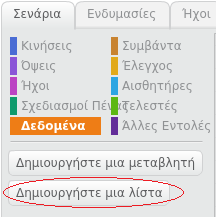
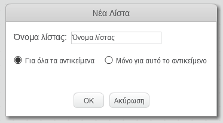
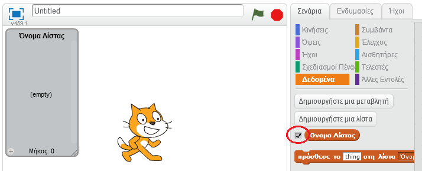
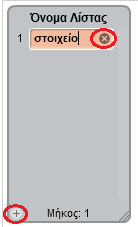
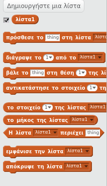

## Κάνε μία λίστα

+ Κάνε κλικ στο **Δεδομένα** στην καρτέλα Σενάρια και, στη συνέχεια, κάνε κλικ στο **Δημιουργήστε μια λίστα**.

+ Πληκτρολογήστε το όνομα της λίστας σας. Μπορείτε να επιλέξετε αν θα θέλατε να είναι διαθέσιμη η λίστα σας σε όλα τα αντικείμενα ή σε ένα συγκεκριμένο αντικείμενο. Πατήστε **OK**.

+ Αφού δημιουργήσεις τη λίστα, αυτή θα εμφανιστεί στο σκηνικό. Μπορείς αν θες να την αποκρύψεις αποεπιλέγοντας τη λίστα στην καρτέλα Σενάρια.

+ Κάνε κλικ στο `+` στο κάτω μέρος της λίστας για να προσθέσεις στοιχεία. Κάνε κλικ στο Χ δίπλα σε ένα στοιχείο για να το διαγράψεις.

+ Θα εμφανιστούν νέα μπλοκ επιτρέποντας να χρησιμοποιήσεις τη νέα λίστα στο έργο σου.

