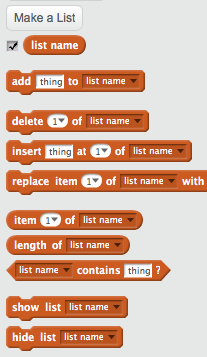

## Hacer una lista

+ Haga clic en | 123_8_0_321 | Datos | 123_9_1_321 | en la pestaña Scripts, luego haga clic en | 123_8_2_321 | Hacer una lista | 123_9_3_321 |.

+ Escriba el nombre de su lista. Puedes elegir si quieres que tu lista esté disponible para todos los sprites o solo para un sprite específico. Presione | 123_8_0_321 | OK | 123_9_1_321 |.

+ Una vez que haya creado la lista, se mostrará en el escenario, o puede desmarcar la lista en la pestaña de Scripts para ocultarla.

+ Haga clic en | 123_6_0_321 | + | 123_7_1_321 | al final de la lista para agregar elementos, y haga clic en la cruz al lado de un elemento para eliminarlo.

+ Aparecerán nuevos bloques y le permitirán usar su nueva lista en su proyecto.

