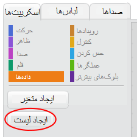
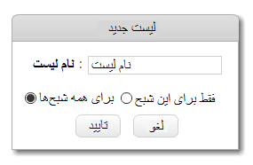
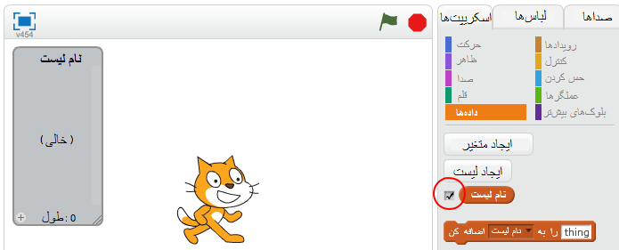
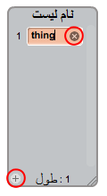
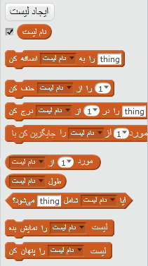

## یک لیست ایجاد کنید

+ در برگه Scripts بر روی **Data** کلیک کنید، سپس روی **Make a List** کلیک کنید.

+ نام لیست خود را وارد کنید. شما می توانید انتخاب کنید که آیا می‌خواهید لیست خود را در دسترس همه‌ی spriteها قرار دهید و یا فقط در دسترس یک sprite خاص باشد. **OK** را فشار دهید.

+ هنگامی که لیست را ایجاد کردید، در stage نمایش داده می‌شود، یا می‌توانید با برداشتن علامت آن در برگه Scripts،آن را پنهان کنید.

+ در پایین لیست برای اضافه کردن موارد، بر روی `+` کلیک کنید و برای حذف یک مورد، بر روی ضربدر کنار آن کلیک کنید.

+ بلوک‌های جدید ظاهر می‌شود و به شما اجازه می‌دهد که از لیست جدید خود در پروژه‌ی خود استفاده کنید.

