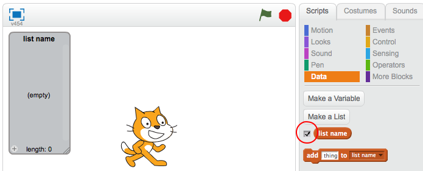
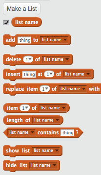

## Tee lista

+ Napsauta **Data** Skriptit-välilehdessä ja napsauta sitten **Tee lista**.

+ Kirjoita luettelon nimi. Voit valita, haluatko listan olevan kaikkien spritsien käytettävissä tai vain tiettyyn spriteeseen. Paina **OK**.

+ Kun olet luonut luettelon, se näkyy lavalla tai voit poistaa luettelon Skriptejä-välilehdestä piilottaaksesi sen.

+ Voit lisätä kohteita napsauttamalla luettelon alalaidassa olevaa `+` ja napsauttamalla sen vieressä olevaa rastiä sen poistamiseksi.

+ Uudet lohkot tulevat näkyviin ja sallivat sinun käyttää uutta luetteloasi projektissa.

