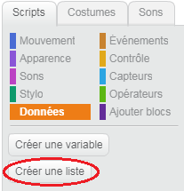
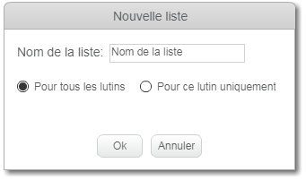
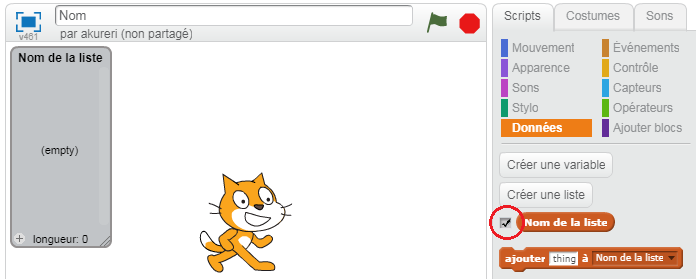
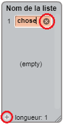
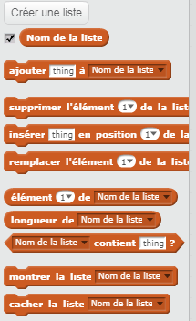

## Fais une liste

+ Cliquez sur | 123_8_0_321 | Données | 123_9_1_321 | Dans l'onglet Scripts, cliquez sur | 123_8_2_321 | Make a List | 123_9_3_321 |.

+ Tapez le nom de votre liste. Vous pouvez choisir si vous souhaitez que votre liste soit disponible pour tous les sprites ou uniquement pour un sprite spécifique. Appuyez sur | 123_8_0_321 | OK | 123_9_1_321 |.

+ Une fois que vous avez créé la liste, elle s'affiche sur la scène ou vous pouvez la décocher dans l'onglet Scripts pour la masquer.

+ Cliquez sur le | 123_6_0_321 | + | 123_7_1_321 | en bas de la liste pour ajouter des éléments et cliquez sur la croix à côté d'un élément pour le supprimer.

+ De nouveaux blocs apparaîtront et vous permettront d'utiliser votre nouvelle liste dans votre projet.

