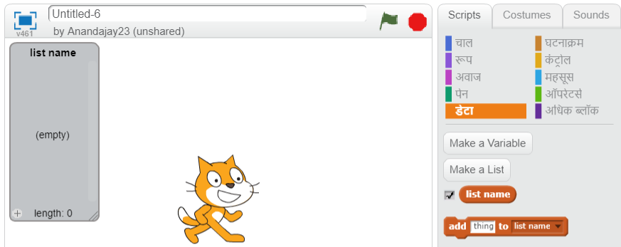
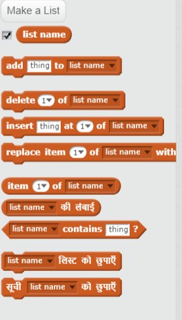

## सूची बनाएँ

+ Scripts टैब पर **Data** पर क्लिक करें, इसके बाद **Make a list** पर क्लिक करें।

+ अपनी सूची का नाम टाइप करें। आप यह चयन कर सकते हैं कि आपकी सूची सभी स्प्राइट्स के लिए उपलब्ध हो या केवल विशेष स्प्राइट के लिए उपलब्ध हो। **OK** दबाएँ।

+ सूची बन जाने पर, यह स्टेज पर दिखाई देगी, या आप इसे छिपाने के लिए Scripts टैब में इसे अनटिक कर सकते हैं।

+ आइटम्स शामिल करने के लिए सूची के नीचे `+` पर क्लिक करें, और किसी आइटम को हटाने के लिए इसके आगे क्रॉस पर क्लिक करें।

+ नए ब्लॉक्स दिखाई देंगे और वे आपको आपके प्रोजेक्ट में आपकी नई सूची का उपयोग करने की सुविधा प्रदान करेंगे।

