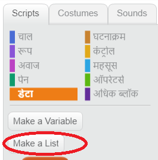

## सूची बनाएँ

+ Scripts टैब पर **डेटा(Data)** पर क्लिक करें, इसके बाद **सूची बनाए(Make a List)** पर क्लिक करें।

+ अपनी सूची का नाम टाइप करें। आप यह चयन कर सकते हैं कि आपकी सूची सभी स्प्राइट्स के लिए उपलब्ध हो या केवल विशेष स्प्राइट के लिए उपलब्ध हो। **ठीक(OK)** दबाएँ।

+ सूची बन जाने पर, यह स्टेज पर दिखाई देगी, या आप इसे छिपाने के लिए स्क्रिप्ट(Scripts) टैब में टिक हटा(untick कर) सकते हैं।

+ चीज़ो(items) को शामिल करने के लिए सूची के नीचे `+` पर क्लिक करें, और किसी चीज़ को हटाने के लिए उसके आगे क्रॉस पर क्लिक करें।

+ नए ब्लॉक्स दिखाई देंगे और वे आपको आपके प्रोजेक्ट में आपकी नई सूची का उपयोग करने की सुविधा प्रदान करेंगे।

