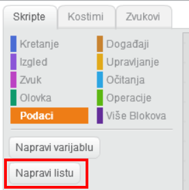
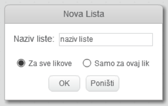
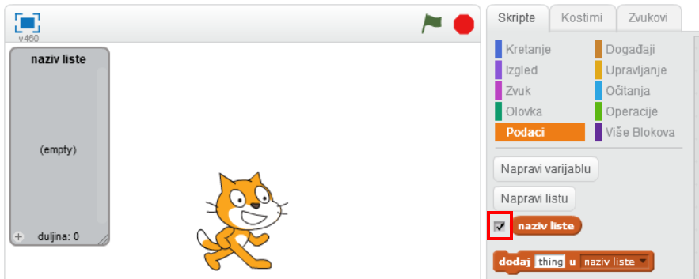
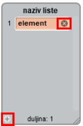
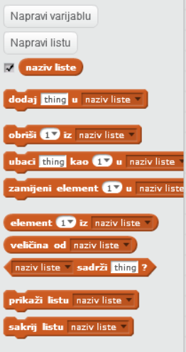

## Napravi listu

+ Klikni na **Podaci** na kartici Skripte, a zatim na **Napravi listu**.

+ Unesi naziv liste. Možeš odabrati želiš li da lista bude dostupna svim likovima ili samo određenom liku. Pritisni **OK**.

+ Nakon što napraviš listu, ona će se prikazati na Pozornici. Možeš maknuti kvačicu kraj liste na kartici Skripte da bi ju sakrio.

+ Klikni na znak `+` pri dnu popisa da bi dodao elemente liste. Klikni na križić pored elementa da bi ga izbrisao.

+ Prikazat će se novi blokovi i omogućiti ti da novu listu koristiš u projektu.

