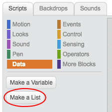

## Készíts egy listát

+ Kattintson a Scripts fülre a **Data** elemre, majd kattintson a **Create a List**Lista létrehozása) parancsra.

+ Írja be a lista nevét. Kiválaszthatja, hogy szeretné-e, hogy a listája elérhető legyen minden sprithez, vagy csak egy adott sprite-hez. Nyomja meg a **OK gombot**.

+ Miután létrehozta a listát, megjelenik a színpadon, vagy eltávolíthatja a listát a Szkriptek lapon, hogy elrejtse.

+ Az elemek hozzáadásához kattintson a lista alján lévő `+` elemre, majd kattintson egy elem melletti keresztre a törléshez.

+ Új blokkok jelennek meg, és lehetővé teszik új listájának felhasználását a projektben.

