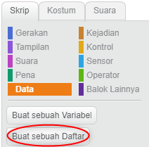
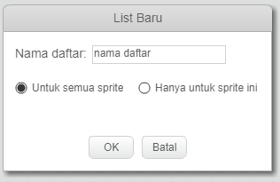
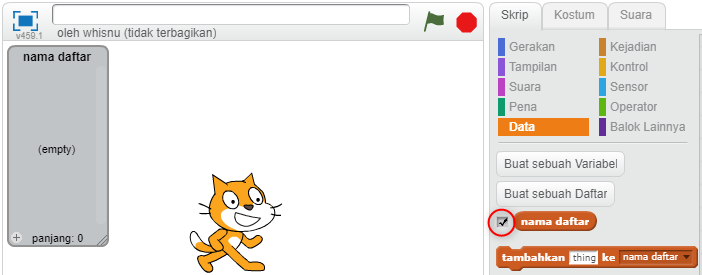
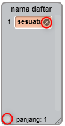
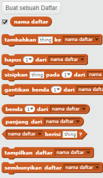

## Membuat sebuah daftar

+ Klik **Data** pada tab Scripts, lalu klik **Buat sebuah Daftar**.

+ Ketik nama daftar Kamu. Kamu dapat memilih apakah Kamu ingin daftar Kamu tersedia untuk semua sprite, atau hanya sprite tertentu. Tekan **OK**.

+ Setelah Kamu membuat daftar, daftar tersebut akan ditampilkan pada Stage, atau Kamu bisa menghapus centang daftar di tab Scripts untuk menyembunyikannya.

+ Klik `+` di bagian bawah daftar untuk menambahkan item, dan klik tanda silang di sebelah item untuk menghapusnya.

+ Blok baru akan muncul dan memungkinkan Kamu untuk menggunakan daftar baru dalam proyek mu.

