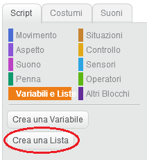
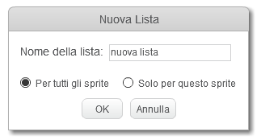
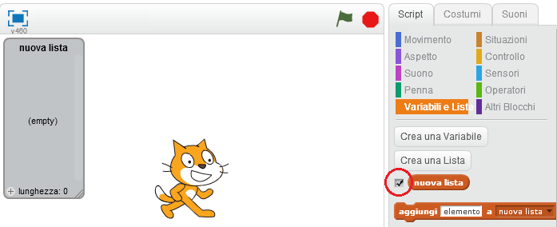
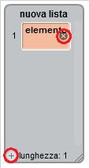
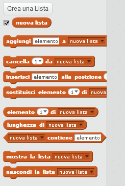

## Creare una lista

+ Nella scheda Script, clicca su **Variabili e Liste**, poi clicca su **Crea una Lista**.

+ Scrivi il nome della tua lista. Puoi scegliere se rendere la tua lista disponibile per tutti gli sprite o solo per questo sprite. Clicca su **OK**.

+ Una volta creata la lista, questa verrà visualizzata sullo stage. Puoi nascondere la lista deselezionandola nella scheda Script.

+ Fai click su `+` in fondo all'elenco per aggiungere elementi alla tua lista, oppure fai clicca sulla x accanto a un elemento per eliminarlo.

+ Appariranno nuovi blocchi che ti permetteranno di usare la tua nuova lista nel tuo progetto.

