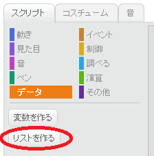
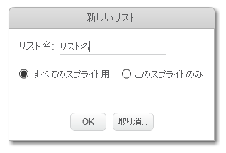
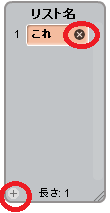
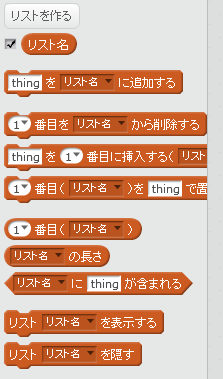

## リストを作る

+ [スクリプト]タブの **データ** をクリックし、 **リストを作る** をクリックします。

+ リストの名前を入力します。リストをすべてのスプライトが使用できるか、特定のスプライトのみかを選択できます。 **OK** を押します。

+ リストの作成後、ステージに表示されますが、[スクリプト]タブでリストの選択を解除して隠すことができます。

+ リストの一番下にある `+` をクリックして項目を追加し、項目の横にある十字をクリックして削除します。

+ 新しいブロックが表示され、新しいリストをプロジェクトで使用できるようになります。

