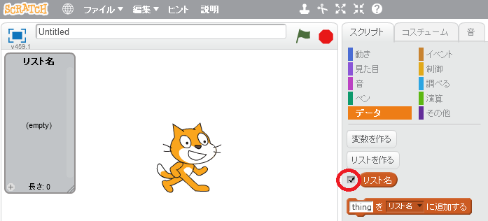

## リストを作る

+ 「スクリプト」タブの **データ** をクリックし、 **リストを作る** をクリックします。

+ リストの名前を入力します。リストをすべてのスプライトが使用できるか、特定のスプライトのみかを選べます。 **OK** を押します。

+ 作ったリストはステージに表示されますが、「スクリプト」タブからリストの選択 (せんたく) を解除(かいじょ) してかくすことができます。

+ リストの一番下にある `+` をクリックして項目 (こうもく) を追加します。削除 (さくじょ) するには、項目の横にある×マークをクリックします。

+ 新しいブロックが表示され、新しいリストをプロジェクトで使用できるようになります。

