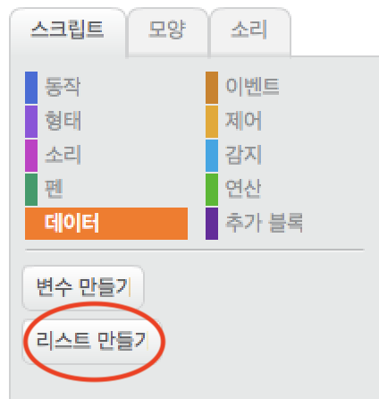
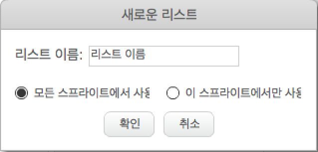
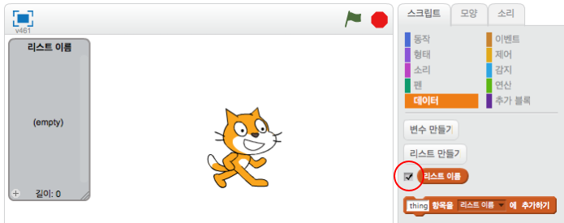
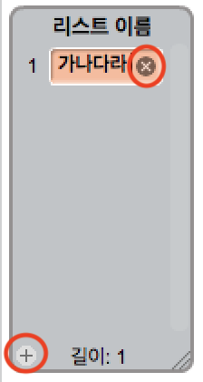
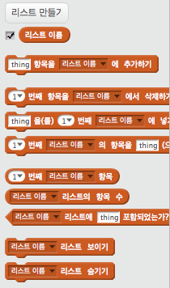

## 목록 만들기

+ 스크립트 탭에서 **데이터** 을 클릭 한 다음 **목록 만들기**을 클릭하십시오.

+ 목록의 이름을 입력하십시오. 목록을 모든 스프라이트에 사용할 지 또는 특정 스프라이트에만 사용할지를 선택할 수 있습니다. **OK**을 누릅니다.

+ 목록을 만든 후에는 무대에 표시되거나 스크립트 탭에서 목록을 탭 해제하여 숨길 수 있습니다.

+ 목록 하단에있는 `+` 을 클릭하여 항목을 추가하고 항목 옆에있는 십자 기호를 클릭하여 항목을 삭제하십시오.

+ 새 블록이 나타나고 프로젝트에서 새 목록을 사용할 수 있습니다.

