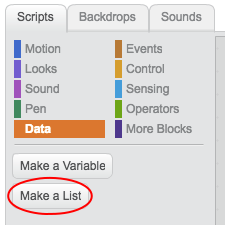
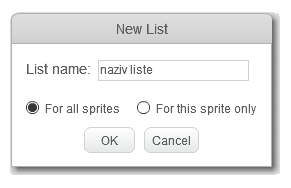
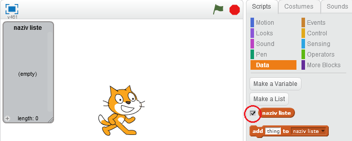
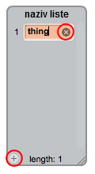
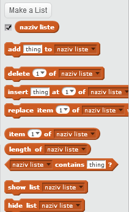

## Napravi listu

+ Klikni na **Data** (Podaci) na kartici Scripts (Skripte), a zatim klikni na **Make a List** (Napravi listu).

+ Upiši naziv svoje liste. Možeš da izabereš da li želiš da tvoja lista bude dostupna svim likovima ili samo određenom liku. Pritisni **OK**.

+ Kada napraviš listu, ona će se prikazati na Pozornici. Možeš maći kvačicu pored liste na kartici Scripts da je sakriješ.

+ Klikni na `+` u donjem dijelu liste da dodaš elemente. Klikni na krstić pored elementa da ga izbrišeš.

+ Pojaviće se novi blokovi koji će ti omogućiti da koristiš novu listu u svom projektu.

