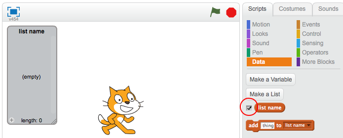
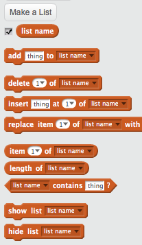

## Membuat senarai

+ Klik pada **Data** dalam tab Skrip, kemudian klik **Buat Senarai**.

+ Taipkan nama senarai anda. Anda boleh memilih sama ada anda mahu senarai anda tersedia untuk semua sprite, atau hanya untuk sprit tertentu. Tekan **OK**.

+ Sebaik sahaja anda telah membuat senarai itu, ia akan dipaparkan di atas pentas, atau anda boleh mengkritik senarai dalam tab Skrip untuk menyembunyikannya.

+ Klik `+` di bahagian bawah senarai untuk menambah item, dan klik salib di sebelah item untuk memadamkannya.

+ Blok baru akan muncul dan membolehkan anda menggunakan senarai baharu anda dalam projek anda.

