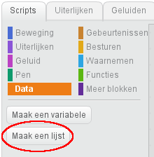
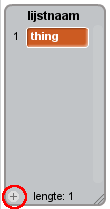

## Maak een lijst

+ Klik op **Data** op het tabblad Scripts en klik vervolgens op **Maak een lijst**.

+ Typ de naam van je lijst in. Je kunt kiezen of de lijst beschikbaar is voor alle sprites of alleen voor een specifieke sprite. Druk op **OK**.

+ Nadat je de lijst hebt gemaakt, wordt deze op het werkblad weergegeven. Je kunt ook de lijst op het tabblad Scripts afvinken om deze te verbergen.

+ Klik op `+` onder aan de lijst om items toe te voegen en klik op het kruisje naast een item om het te verwijderen.

+ Nieuwe blokken verschijnen en laten je de nieuwe lijst in je project gebruiken.

