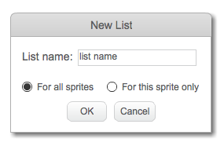

## Lage en liste

+ Klikk på **Data** i Skript-kategorien, og klikk deretter på **Lag en liste**.

+ Skriv inn navnet på listen din. Du kan velge om du vil at listen din skal være tilgjengelig for alle sprites, eller til bare et bestemt sprite. Trykk **OK**.

+ Når du har opprettet listen, vil den bli vist på scenen, eller du kan slå av listen i kategorien Skript for å skjule den.

+ Klikk `+` nederst på listen for å legge til elementer, og klikk på krysset ved siden av et element for å slette det.

+ Nye blokker vises og lar deg bruke den nye listen i prosjektet ditt.

