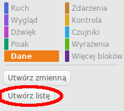
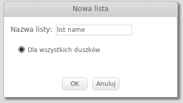
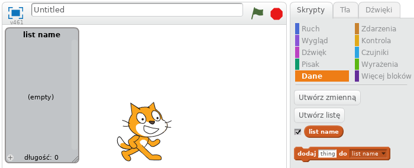
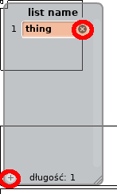
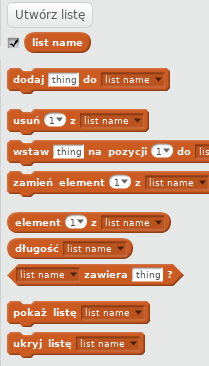

## Zrobić listę

+ Kliknij **Dane** na karcie Skrypty, a następnie kliknij **Utwórz listę**.

+ Wpisz nazwę swojej listy. Możesz wybrać, czy chcesz, aby twoja lista była dostępna dla wszystkich duszków, czy tylko dla konkretnego sprite'a. Naciśnij **OK**.

+ Po utworzeniu listy zostanie ona wyświetlona na scenie lub można ją odznaczać na karcie Skrypty, aby ją ukryć.

+ Kliknij `+` na dole listy, aby dodać elementy, i kliknij krzyżyk obok elementu, aby go usunąć.

+ Pojawią się nowe bloki i pozwoli Ci użyć nowej listy w projekcie.

