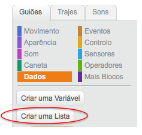
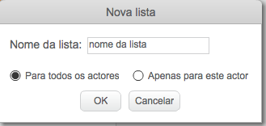
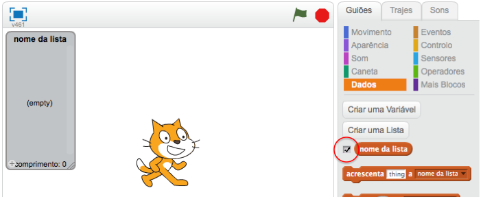
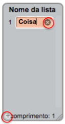
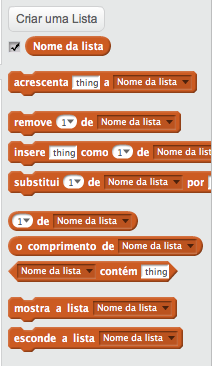

## Faz uma lista

+ Clica em **Dados** no menu Guiões e, em seguida clica em **Criar uma lista**.

+ Digita o nome da tua lista. Podes escolher se desejas que a tua lista esteja disponível para todos os actores ou apenas para um actor específico. Pressiona **OK**.

+ Depois de criares a lista ela será exibida no palco, ou podes desmarcar a lista no menu Guiões para ocultá-la.

+ Clica em `+` na parte inferior da lista para adicionar itens e clica na cruz ao lado de um item para o remover.

+ Aparecerão novos blocos e permitirão que uses a tua nova lista no teu projeto.

