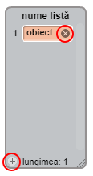

## Creați o listă

+ Faceți clic pe **Date** din tab-ul Scripturi, apoi pe **Creează o listă**.

+ Introduceți numele listei. Puteți alege dacă doriți ca lista dvs. să fie disponibilă pentru toate personajele sau doar pentru un anumit personaj. Apăsați **OK**.

+ Odată ce ați creat lista, aceasta va fi afișată pe scenă, sau puteți debifa lista din fila Scripturi pentru a o ascunde.

+ Faceți clic pe `+`, în partea de jos a listei, pentru a adăuga elemente și faceți clic pe cruciulița de lângă un element pentru a-l șterge.

+ Se vor afișa noi blocuri care vă vor permite să utilizați noua dvs. listă în proiect.

