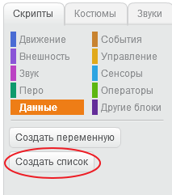
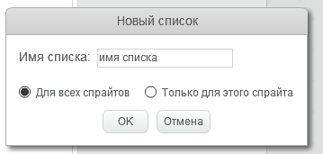
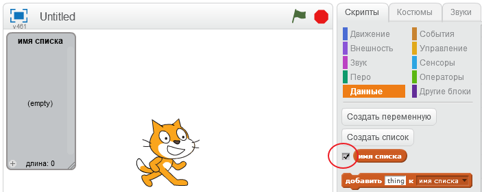
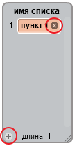
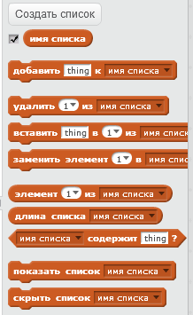

## Создаем список

+ На вкладке "Скрипты" щелкни на кнопке **Данные**, а затем нажми кнопку **Создать список**.

+ Введи имя своего списка. Ты можешь выбрать, хочешь ли ты, чтобы твой список был доступен для всех спрайтов или только для конкретного спрайта. Нажми **OK**.

+ После того, как тобой был создан этот самый список, ты можешь указать: хочешь ли ты, чтобы он отображался на сцене. Сделать это можно на вкладке «Скрипты».

+ Нажми кнопку `+` в нижней части списка, чтобы добавить элементы. Удалить элемент списка можно щелкнув по кнопке-крестике, которая находится в его правой части.

+ Появятся новые блоки и ты сможешь использовать свой новый список в своем проекте.

