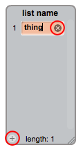

## Bir liste yap

+ Komut Dosyası sekmesinde **Veri** tıklayın, ardından **Liste Oluştur**.

+ Listenizin adını yazın. Listenizin tüm spritelar için mi yoksa sadece belirli bir sprite mı sahip olmasını isteyip istemediğinizi seçebilirsiniz. **OK**tuşuna basın.

+ Listeyi oluşturduktan sonra, sahnede görüntülenir veya listeyi Scripts sekmesinde gizlemek için listeyi kaldırabilirsiniz.

+ Öğe eklemek için listenin en altındaki `+` tıklayın ve silmek için bir öğenin yanındaki hatayı tıklayın.

+ Yeni bloklar görünecek ve yeni listenizi projenizde kullanmanıza izin verecektir.

