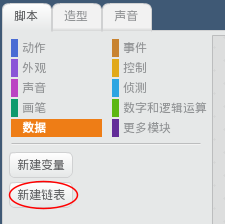
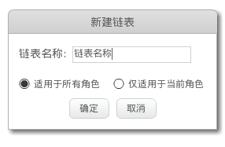
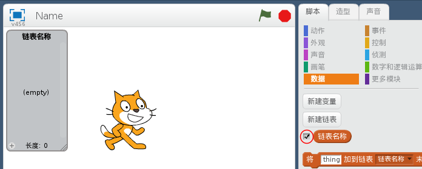
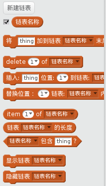

## 创建列表

+ 点击脚本标签中的 **数据** ，然后点击 **新建变量**。

+ 输入变量的名称。你可以选择你是否希望你的变量可用于所有的角色，或者只有这个角色。按 **确定**。

+ 一旦你创建好列表，它会显示在舞台上，或者你可以在脚本选项页中取消列表来隐藏它。

+ 在列表底部点击`+`符号来增加项目，点击旁边的叉来删除项目。

+ 新的块会出现，并允许您在项目中使用新的列表。

