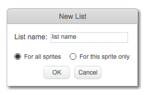

## 做一個列表

+ 點擊腳本標籤中的 **數據** ，然後點擊 **製作列表**。

+ 輸入你的清單名稱。你可以選擇你是否希望你的列表可用於所有的精靈，或只有特定的精靈。按 **確定**。

+ 一旦創建了列表，它將顯示在舞台上，或者您可以在“腳本”選項卡中取消選中列表以隱藏它。

+ 點擊列表底部的 `+` 添加項目，然後點擊項目旁邊的十字會將其刪除。

+ 新塊將出現，並允許您在項目中使用新列表。

